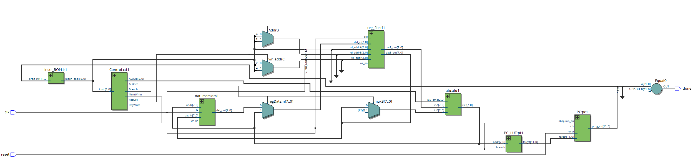
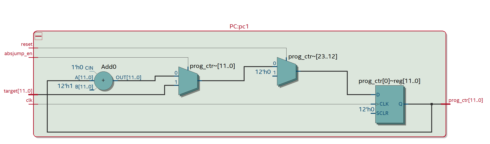
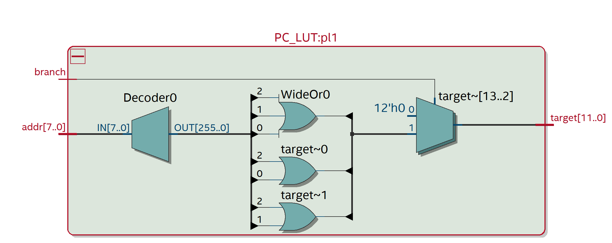
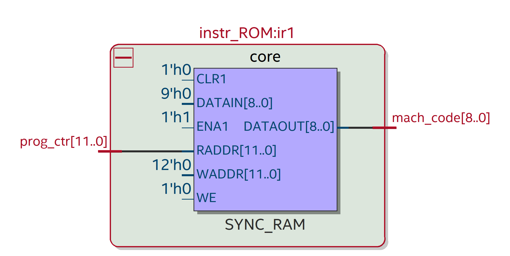
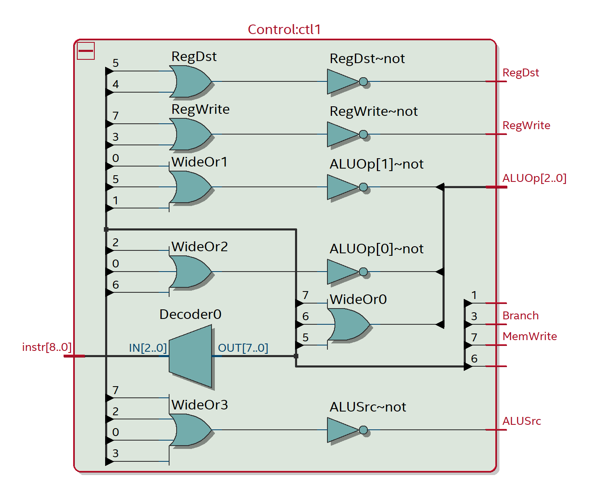
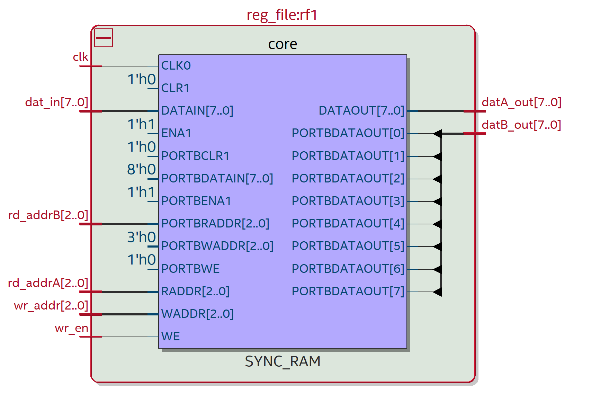
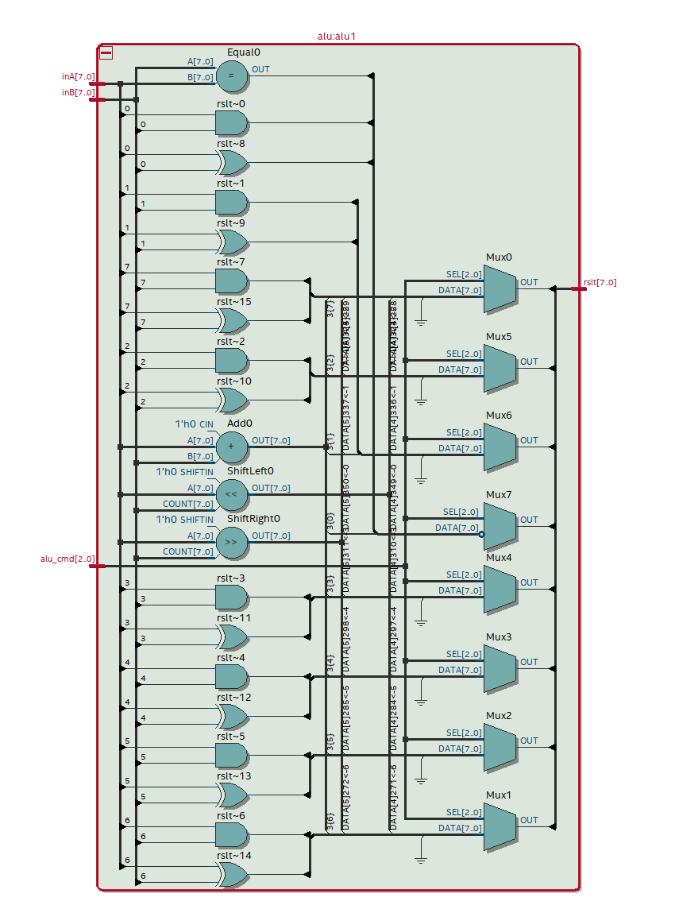
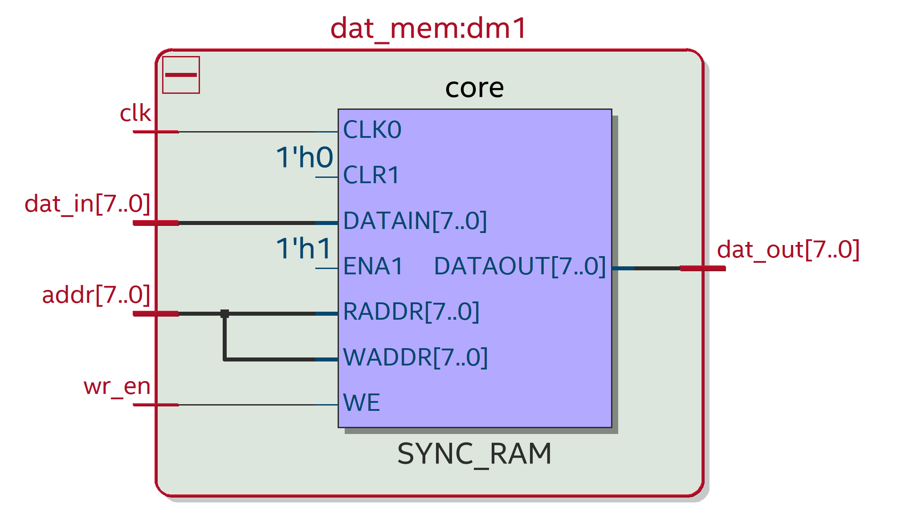

This document will hold all screenshots from Quartus and ModelSim for the over schematic, components, and timing diagrams.

# Overall Schematic

## PC

The program counter is a simple adder with a register file. Where with each instruction ran it will be incremented by one. However, if a branch instruction is called then the target value will replace the current value in the register to jump places in the machine code. This target value is fed in from the PC_LUT. The PC outputs the value of what instruction number will be run next.

## PC_LUT

The program ccounter look up table is where we satore specific addresses that will be passed as a target into the program counter. Allowing us to jump to specific lines in the machine code. The inputs are the address; which is a numberic value that will be matches in a case statment to return a vlaue of where to jump to. And the branch input; which is a boolean flag from the control that tells us if we are performing a branch instruction. The target output is a numberic value fed into the PC to overwrite the current pc value.

## Instr_ROM

The instruction rom is the unit that will take the current program counter value as input and convert that in machine code that the control can use to control the flow of data.

## Control

The control is the main unit that drives what values will be passed through a mux, what operations are performed in the ALU, and affect if we read or write to memory. This takes in the machine code as an input and looks at the top 3-bits to see what ALU opration is performed. Based on the operation it will turn on or off a selection of signals that will affect the memory operations, muxes, and if we use immediates or not. Since there are operations with 2 and 4-bit immediates and operations with registers. All the outputs are boolean flags to control the direction of data throughout the architecture.

## Reg File

The regsiter file is the component that holds short term values used in immediate operations within a program. Within our design we have 4 registers so there would be 4 reg files. In has inputs for the clock, write enable, and data in to perform write operations to a register file. While having two read address inputs to tell us what registers we are accessing. The outputs for this is the register information we are accessing based on the read addresses.

## ALU

The ALU is unit that will take in the memory from the register file(s) and/or an immediate value from the machine code and perform operations based. It has the following operations `AND, ADD, XOR, LS, RS, LW, SW, & BNE`. Each decided by the ALUOp provided by the control unit as teh alu_cmd input. It has inA and inB which are the data from the registers that will be used for specific operations. And an alu_cmd which comes from the control to tell the ALU whcih operation to perform. It has an output called rslt; which is the rslt of the operation.

## Dat_Mem

Thhe data memory unit is the component used to fetch or write to the core memory of the system. In takes in a clock input, a write enable input(provided by the control), and data_in(a register provided in the ALU) to perform write operations. Additionally it has an address, which is the result of the ALU, to take where in memory will be accessed or written to. It then will output the data that was accessed, which will be fed back to the register file.